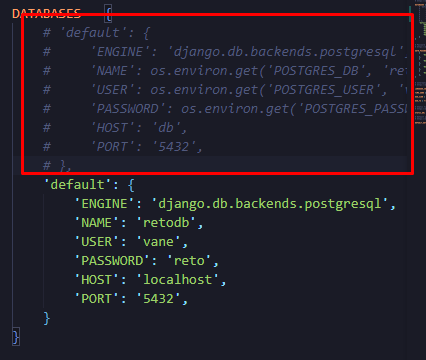

# Reto Django REST Framework 

Este es un proyecto Django REST Framework para gestionar vulnerabilidades. Este README explica cómo configurar, ejecutar y probar la aplicación. 

El objetivo de la aplicación es gestionar la seguridad de los sistemas desplegados en la infraestructura Cloud mediante la integración con la base de datos de vulnerabilidades del NIST (https://nvd.nist.gov/developers/vulnerabilities). 

## Requisitos

- Python 3.8 o superior
- Django 3.0 o superior
- Django REST Framework
- Docker
- Otras dependencias listadas en `requirements.txt`

## Instalación con Docker

### 1. Clonar el Repositorio

Primero, clona el repositorio desde GitHub:

```bash
git clone https://github.com/Vane789/reto-crm.git
cd reto-crm
```
### 2. Construir y Ejecutar los Contenedores
```bash
docker-compose up --build
```

### 3. Aplicar Migraciones de Base de Datos
```bash
docker-compose exec web python manage.py migrate
```

### 4. Acceder a la Aplicación
La aplicación debería estar accesible en http://localhost:8000. Puedes acceder a los endpoints de la API a través de esta URL.

### 5. Acceder a la Base de Datos (Opcional)
Si necesitas acceder a la base de datos PostgreSQL desde una herramienta externa como DBeaver, utiliza los siguientes parámetros de conexión:
```JSON
Host: localhost
Puerto: 5432
Nombre de la base de datos: retodb
Usuario: vane
Contraseña: reto
Asegúrate de que el contenedor db esté en ejecución y que el puerto 5432 esté expuesto.
```

## Instalación sin Docker

### 1. Clonar el repositorio

Primero, clona el repositorio desde Github:

```bash
git clone https://github.com/Vane789/reto-crm.git
cd reto-crm
```

### 2. Crear y Activar un Entorno Virtual:
```bash
python3 -m venv nombre_del_entorno

# Para instalar las librerías dentro del entorno
# Primero se debe activar el entorno con el siguiente comando:
Linux/Max = source nombre_del_entorno/bin/activate
Windows = nombre_del_entorno\Scripts\activate
```

### 3. Instalar las dependencias
```bash
pip install -r requirements.txt

#Verifica la instalación de las dependencias
pip list
```
### 4. Levantar postgres con una imagen de docker
#### 1. Instalar Docker descárgalo e instálalo desde [Docker](https://www.docker.com/products/docker-desktop/)
#### 2. Descargar la imagen de PostgreSQL
```bash
docker pull postgres
```
#### 3. Ejecutar el contenedor de PostgreSQL
```bash
docker run --name postgres_db -e POSTGRES_DB=mydatabase -e POSTGRES_USER=myuser -e POSTGRES_PASSWORD=mypassword -p 5432:5432 -d postgres
```
#### 4. Verificar que el contenedor está corriendo
```bash
docker ps
```
### 5. Realizar migraciones
```bash
python magane.py migrate
```
### 6. Configuración previa del database
En settings comenta el primer default

### 7. Iniciar el servidor de desarrollo
```bash
python magane.py runserver
```
## Ejecución pruebas
### Con Docker
```bash
docker-compose exec web python manage.py test
```
### Sin Docker
```bash
python manage.py test
```

### Notas Adicionales
1. **Para el uso con Docker**: Asegúrate de que el contenedor de PostgreSQL y la aplicación web estén corriendo correctamente. Puedes verificar el estado de los contenedores con `docker ps`.

2. **Para el uso sin Docker**: Asegúrate de que PostgreSQL esté instalado y configurado correctamente en tu máquina local.